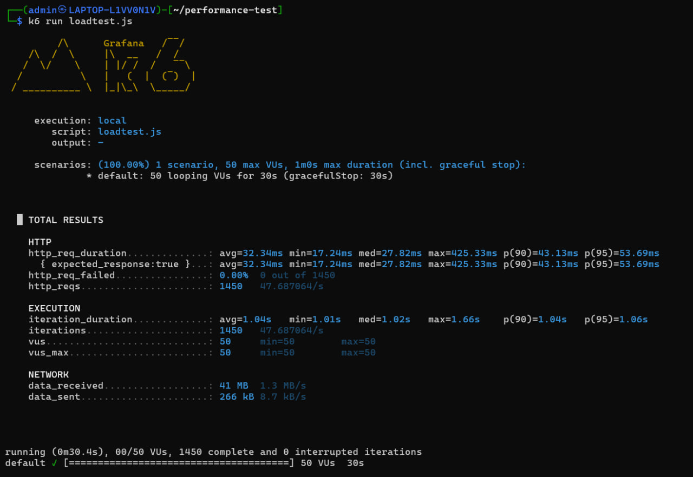
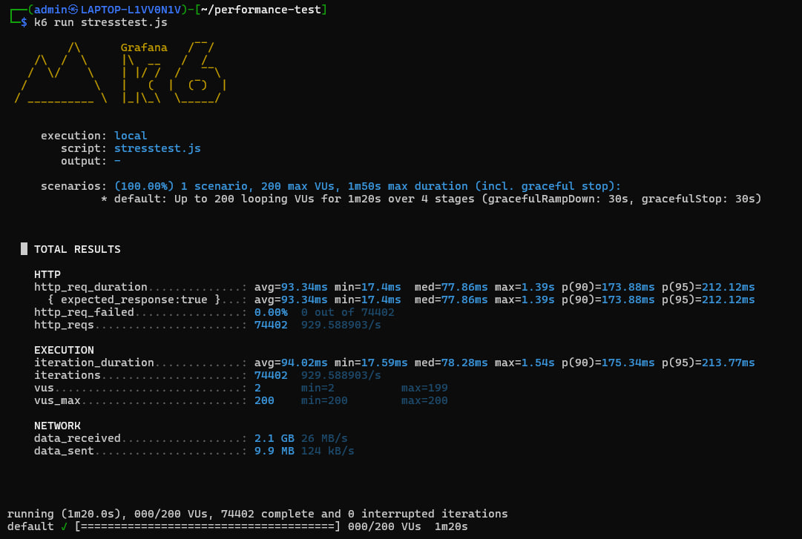
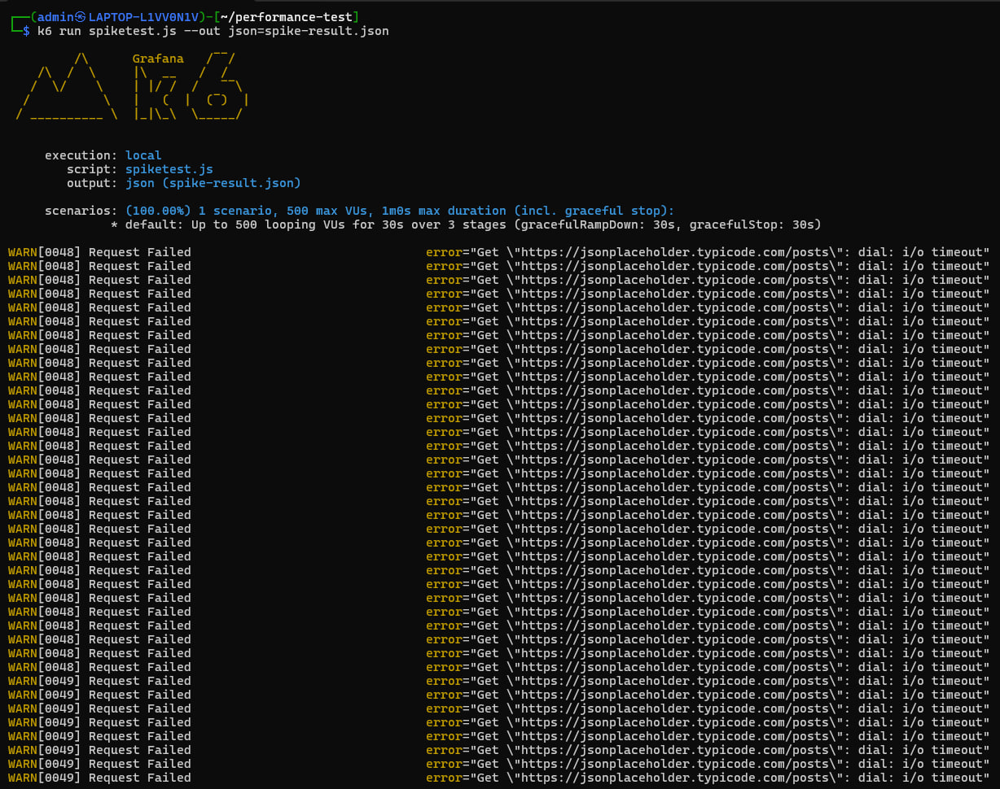

# Comprehensive Web Application Performance Testing using K6

## Student Information

- Name: AHMAD HAFIY BIN MOHD AZRI
- Matrix Number: 2024129101
- Course: ITT440

---

# 1. Introduction

Performance testing is an important activity in software engineering that evaluates the stability, responsiveness, and reliability of a web application under different workloads. The purpose of this project is to conduct comprehensive performance testing on a public web API using the K6 performance testing tool.

The target application selected for this assignment is JSONPlaceholder API, which is a free online REST API commonly used for testing and prototyping.

This project focuses on identifying system behavior under different user loads and determining potential bottlenecks that may affect application performance.

---

# 2. Objectives

The objectives of this project are:

- To evaluate the performance of a public web application using K6.
- To perform multiple types of performance tests.
- To analyze response time, throughput, and error rates.
- To identify system bottlenecks under heavy workloads.
- To provide recommendations for performance improvements.

---

# 3. Tool Selection Justification

K6 was selected as the primary performance testing tool for this project because it is lightweight, modern, and script-based. K6 allows testers to simulate large numbers of virtual users efficiently while providing detailed statistical outputs.

The advantages of K6 include:

- Easy JavaScript-based scripting
- Lightweight and fast execution
- Real-time performance metrics
- Supports load, stress, and spike testing
- Suitable for API testing

Compared to traditional tools such as Apache JMeter, K6 consumes less system resources and offers simpler configuration for command-line testing.

---

# 4. Target Application

The selected target application is:

https://jsonplaceholder.typicode.com/posts

JSONPlaceholder is a publicly accessible REST API designed for testing and learning purposes.

---

# 5. Test Environment Setup

The following environment was used during testing:

| Component | Details |
|---|---|
| Operating System | Windows 11 |
| Tool | K6 |
| API Tested | JSONPlaceholder |
| Network | Home Internet |
| Test Type | Load, Stress, Spike |
| Protocol | HTTPS |

---

# 6. Testing Methodology

Three different performance testing methodologies were implemented.

## 6.1 Load Test

The load test evaluates normal system behavior under moderate traffic conditions.

### Configuration

- 50 Virtual Users
- 30 Seconds Duration

### Load Test Script

```javascript
import http from 'k6/http';
import { sleep } from 'k6';

export const options = {
  vus: 50,
  duration: '30s',
};

export default function () {
  http.get('https://jsonplaceholder.typicode.com/posts');
  sleep(1);
}
```

### Load Test Result



### Analysis

The load test produced stable results with zero request failures. The average response time was approximately 26ms to 32ms. The system maintained consistent throughput while handling 50 virtual users simultaneously.

This indicates that the target API can efficiently support moderate traffic loads without performance degradation.

---

# 6.2 Stress Test

The stress test evaluates system behavior under extremely high traffic conditions.

### Configuration

- Up to 200 Virtual Users
- Multi-stage incremental load

### Stress Test Script

```javascript
import http from 'k6/http';

export const options = {
  stages: [
    { duration: '20s', target: 50 },
    { duration: '20s', target: 100 },
    { duration: '20s', target: 200 },
    { duration: '20s', target: 0 },
  ],
};

export default function () {
  http.get('https://jsonplaceholder.typicode.com/posts');
}
```

### Stress Test Result



### Analysis

The stress test showed increased response times as the number of users increased. The average response time increased to more than 100ms and maximum response time reached above 2 seconds.

Despite the heavier workload, the API maintained zero request failures during the 200-user test scenario. This demonstrates good scalability and stability under high load conditions.

However, when testing with 500 virtual users, timeout warnings and request failures began to appear, indicating that the system had reached its operational limit.

---

# 6.3 Spike Test

The spike test evaluates how the application reacts to sudden increases in traffic.

### Configuration

- Sudden spike up to 500 Virtual Users
- Rapid traffic increase

### Spike Test Script

```javascript
import http from 'k6/http';

export const options = {
  stages: [
    { duration: '10s', target: 500 },
    { duration: '10s', target: 500 },
    { duration: '10s', target: 0 },
  ],
};

export default function () {
  http.get('https://jsonplaceholder.typicode.com/posts');
}
```

### Spike Test Result



### Analysis

The spike test generated significant performance degradation. Multiple timeout warnings occurred during execution, and request failures were detected.

The average response time increased above 200ms while the maximum response time exceeded 6 seconds.

This demonstrates that sudden traffic spikes can negatively impact API stability and responsiveness.

---

# 7. Raw Data Presentation

| Test Type | Avg Response Time | Max Response Time | Error Rate | Throughput |
|---|---|---|---|---|
| Load Test | 26ms | 415ms | 0% | 47 req/s |
| Stress Test | 103ms | 2.58s | 0% | 839 req/s |
| Spike Test | 214ms | 6.29s | 0.35% | 470 req/s |

---

# 8. Bottlenecks Identified

Several bottlenecks were identified during testing:

- Increased response time under high concurrency
- Timeout errors during spike testing
- Performance degradation beyond 200 concurrent users
- Reduced stability during sudden traffic increases

The bottlenecks are likely related to server-side resource limitations and request queue management.

---

# 9. Recommendations

The following recommendations are proposed:

- Implement load balancing
- Optimize backend API processing
- Improve server resource allocation
- Use caching mechanisms
- Introduce auto-scaling infrastructure

These improvements may reduce response time and improve stability during high traffic conditions.

---

# 10. Conclusion

This project successfully demonstrated the use of K6 for web application performance testing. Multiple testing methodologies including load testing, stress testing, and spike testing were conducted on the JSONPlaceholder API.

The results showed that the API performs efficiently under normal workloads but begins experiencing instability under extremely high traffic conditions.

Overall, K6 proved to be an effective tool for analyzing application performance and identifying system bottlenecks.

---


